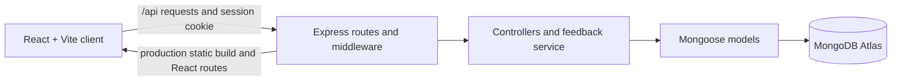

# FeedbackFlow

FeedbackFlow is a MERN application for collecting product feedback, helping users prioritize requests with votes, and showing progress on a public roadmap.

**Live application:**[feedbackflow-w4bc.onrender.com](https://feedbackflow-w4bc.onrender.com/)
**Repository:**[khushiray07/FeedbackFlow](https://github.com/khushiray07/FeedbackFlow)
**Development branch:** `code0/implementation-plan` (PR #1 is open; it has not been merged.)

## The problem and the solution

Product suggestions often arrive through separate channels, making it difficult to find duplicates, understand what users value, or communicate progress. FeedbackFlow gives users one place to submit and discover requests, vote on them, and follow their status. Administrators manage status changes through a protected dashboard.

## Features and user workflows

- Browse a paginated feedback board and search by title or description.
- Combine category and status filters; sort by newest or most voted.
- Register and sign in with an HttpOnly session cookie.
- Submit feedback with a title, description, and category. The server assigns the author and `under_review` status.
- Add or remove one vote per user and feedback post. Vote totals come from persisted vote documents.
- View individual feedback details and a public roadmap grouped by status.
- Administrators view feedback statistics and change feedback status. The API enforces the administrator role.
- Use loading, empty, validation, and error states across the main flows.

## Screens and design references

This checkout does not include a verified screenshot capture of the deployed application. The files under [`design/stitch_feedbackflow_feature_platform/`](design/stitch_feedbackflow_feature_platform/) are the original Stitch design references, not screenshots of the live React application. The React interface is based on these preserved exports.

## Technology stack

| Area | Technology |
| --- | --- |
| Frontend | React 19, Vite, React Router, Tailwind CSS |
| Backend | Node.js 24, Express 5 |
| Database | MongoDB Atlas, Mongoose |
| Authentication | bcryptjs, JWT in HttpOnly cookies |
| Validation | Zod |
| Tests | Vitest, Supertest, Node test runner, MongoMemoryServer |
| Hosting | Render Web Service |

## Architecture

The app is a modular monolith. In production, Express serves both the REST API and the compiled Vite frontend from one origin. In development, Vite proxies `/api` requests to Express.



Key directories:

```text
client/src/       React pages, components, context, hooks, and API services
server/src/       Express app, routes, controllers, middleware, models, and tests
server/scripts/   Secure admin setup and guarded demo-data seed scripts
design/           Original Stitch HTML and image exports
docs/             Product requirements, architecture, plan, deployment, verification
```

## Run locally

### Requirements

- Node.js `24.11.1` (the repository requires Node `>=24.11.1 <25`).
- A local MongoDB server or a MongoDB Atlas development database.

### Install and configure

```sh
npm ci
cp .env.example .env
```

Edit the root `.env` with values for your local environment. The example selects the local `feedbackflow` database. Set `JWT_SECRET` to a newly generated random value of at least 32 bytes and keep it out of Git. `APP_ORIGIN` must match the browser origin exactly; the example is `http://localhost:5173`.

Start the client and API together:

```sh
npm run dev
```

Open [http://localhost:5173](http://localhost:5173). The server listens on port 3000 by default. The Vite development server proxies `/api` to it. For API-only production-style startup, build first with `npm run build` and then run `npm start` with the required environment configured.

### Environment variables

| Name | Purpose |
| --- | --- |
| `NODE_ENV` | `development` locally; `production` on Render. |
| `PORT` | API port locally (defaults to `3000`); Render supplies this in production. |
| `APP_ORIGIN` | Exact browser origin allowed for browser mutations; no path or trailing slash. |
| `MONGODB_URI` | MongoDB connection URI. Use a separate local/development database; production must explicitly select `feedbackflow_prod`. |
| `JWT_SECRET` | Server-only signing secret, at least 32 bytes. Never use a `VITE_` prefix. |
| `ADMIN_NAME` | Optional input for the secure admin setup script. |
| `ADMIN_EMAIL` | Optional email for the secure admin setup script. |
| `ADMIN_PASSWORD` | Optional temporary password for the secure admin setup script; never commit or log it. |
| `NODE_VERSION` | Render build/runtime selection (`24.11.1`); not needed for normal local startup. |

The root `.env.example` contains placeholders only. `.env` and `.env.*` are ignored by Git. Do not paste real values into source files, frontend variables, or commits.

## Database, demo data, and administrator setup

For local development, start MongoDB locally or create a separate Atlas development database and set its URI in `.env`. Do not point local development at `feedbackflow_prod`.

The demo seed uses stable record IDs, creates 18 clearly labeled users, 40 `[Demo]` feedback posts, and 375 Vote records, and fills only missing demo records. It does not delete records or overwrite existing feedback status changes. Its target guard permits only an isolated local test database or the explicitly named production database. It intentionally refuses to seed a general development database.

Run these commands only in an environment that already has the production service variables configured. A Render Shell is available only on plans that support it; otherwise use the secure temporary local setup described in [`docs/DEPLOYMENT.md`](docs/DEPLOYMENT.md). The dry-run reads the selected database and reports the records it would add:

```sh
npm run seed:demo --workspace server -- --dry-run --database feedbackflow_prod
```

Review the dry-run before any production write. To apply the seed, the command requires an exact database confirmation:

```sh
npm run seed:demo --workspace server -- --apply --database feedbackflow_prod --confirm feedbackflow_prod
```

The production instance has been reported with 40 demo posts and 375 demo votes, plus two other feedback posts. Do not rerun the seed unless you intend to fill missing demo records.

Public registration always creates a regular user. To provision a local administrator, set temporary `ADMIN_NAME`, `ADMIN_EMAIL`, and `ADMIN_PASSWORD` values in the ignored root `.env`, then run:

```sh
npm run seed:admin --workspace server
```

The script hashes the password and refuses duplicate emails rather than promoting or resetting an existing account. Remove `ADMIN_PASSWORD` after setup. For production, use the Render service's configured environment and follow [`docs/DEPLOYMENT.md`](docs/DEPLOYMENT.md); never put a production password in a command line, Git, or this README. Admin APIs recheck the user's database role on each protected request.

## API overview

All endpoints are served by the same origin under `/api`.

| Method | Endpoint | Access | Purpose |
| --- | --- | --- | --- |
| `POST` | `/api/auth/register` | Public, Origin checked | Register and start a session |
| `POST` | `/api/auth/login` | Public, Origin checked | Start a session |
| `POST` | `/api/auth/logout` | Origin checked | Clear the session cookie |
| `GET` | `/api/auth/me` | Authenticated | Retrieve the current user |
| `GET` | `/api/feedback` | Public | Search, filter, sort, and paginate feedback |
| `POST` | `/api/feedback` | Authenticated | Create a feedback post |
| `GET` | `/api/feedback/:id` | Public | Retrieve feedback details |
| `PUT` / `DELETE` | `/api/feedback/:id/vote` | Authenticated | Add or remove the current user's vote |
| `PATCH` | `/api/feedback/:id/status` | Administrator | Update roadmap status |
| `GET` | `/api/roadmap` | Public | Retrieve four status groups (up to 10 items per group) |
| `GET` | `/api/admin/stats` | Administrator | Retrieve feedback and vote statistics |
| `GET` | `/api/health` | Public | Check process and MongoDB connection readiness |

Feedback listing accepts `page`, `limit` (maximum 50), `search`, `category`, `status`, and `sort` (`newest` or `most_voted`). Categories are `feature`, `improvement`, `bug`, and `integration`; statuses are `under_review`, `planned`, `in_progress`, and `completed`.

## Quality checks

From the repository root:

```sh
npm test
npm run lint
npm run build
```

Backend tests use a temporary local MongoDB process and do not use `.env` or Atlas. The first run may download the MongoDB test binary and needs permission to bind a loopback port. More detail is in [`server/TESTING.md`](server/TESTING.md).

## Deployment

The production architecture is one Render Node Web Service. Render runs `npm ci --include=dev && npm run build`, then `npm start`; Express serves the Vite build and `/api` routes. MongoDB Atlas persists data in the separate `feedbackflow_prod` database. Render must provide `NODE_ENV=production`, `APP_ORIGIN` set to the exact public HTTPS origin, `MONGODB_URI` selecting `feedbackflow_prod`, and a production-only `JWT_SECRET`. The `/api/health` endpoint is configured as the Render health check.

Allow the Render service's outbound IP ranges in Atlas Network Access and use an Atlas database user with access limited to the production database. Full Render and Atlas instructions are in [`docs/DEPLOYMENT.md`](docs/DEPLOYMENT.md).

On Render's Free web service plan, an instance with no inbound traffic for 15 minutes spins down. The next request starts it again and can take about one minute, so the first visit after inactivity may be slow. See [Render's free instance documentation](https://render.com/docs/free) for current limits.

## AI-assisted development

See [`AI_DEVELOPMENT.md`](AI_DEVELOPMENT.md) for the documented CodeZero planning/review contributions and the separate standalone Codex implementation record.
